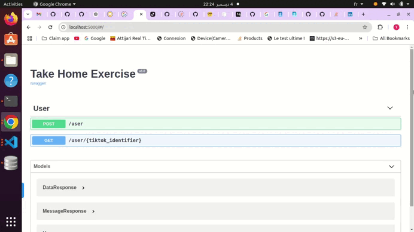

# Python Developer - Take Home Exercise
- This exercise is about implementing the best possible solution to the problem: collecting data about tiktok users.

<p align="center">
  
</p>

## Built With

- Python
- FLask
- TikTok-Api

## Getting Started

**To get a local copy up and running follow these simple example steps:**

### Prerequisites

- [Python](https://www.python.org/)

### Setup

- Make sure to create a virtual environment using this command line:

```
$ python3 -m venv /path/to/new/virtual/environment
```

- Clone the repo using this command line:

``` sh
  git clone https://github.com/taher-software/Take-Home-Exercise

```

### Install

```sh
  pip install -r requirements.txt
```

### First Time
```bash
flask db init
flask db migrate
flask db upgrade
```

### Run

```
  python main.py
```

## Notes:

- How much time it took?:  

It took approximately three hours of work to complete. However, the entire exercise required more time due to issues with the TikTok-Api. I encountered a problem with the playwright package, which is a dependency for TikTok-Api, and resolving it took about 90 minutes. Additionally, I spent significant time reviewing the TikTok-Api documentation to find an API method that allows fetching user data using a user ID.

- Issues/challenges you faced:  

I encountered numerous issues with the playwright package, a dependency for TikTok-Api. I spent a considerable amount of time identifying that the problem was with the package itself and that only a specific version could resolve it. Additionally, I devoted significant time to reviewing the TikTok-Api documentation to find an API method that allows fetching user data using a user ID.

- database design: 
 
I used SQLite to design my database, creating a single table for storing user information.  

- Possible ways to improve the api:  
A potential improvement for the API would be to utilize the official TikTok APIs.


## 🤝 Contributing

Contributions, issues, and feature requests are welcome!

Feel free to check the [issues page](../../issues/).

